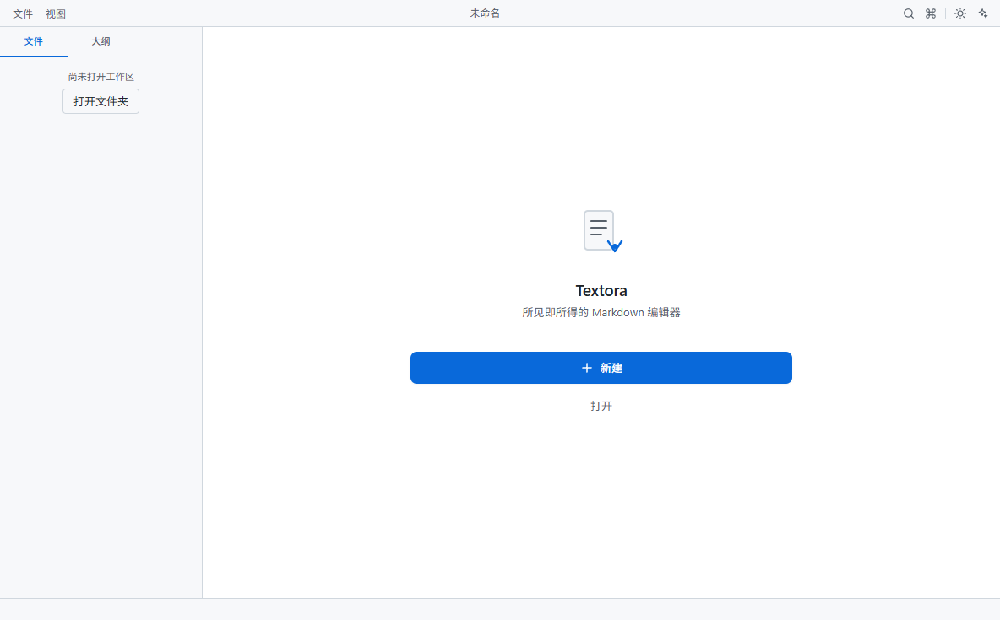
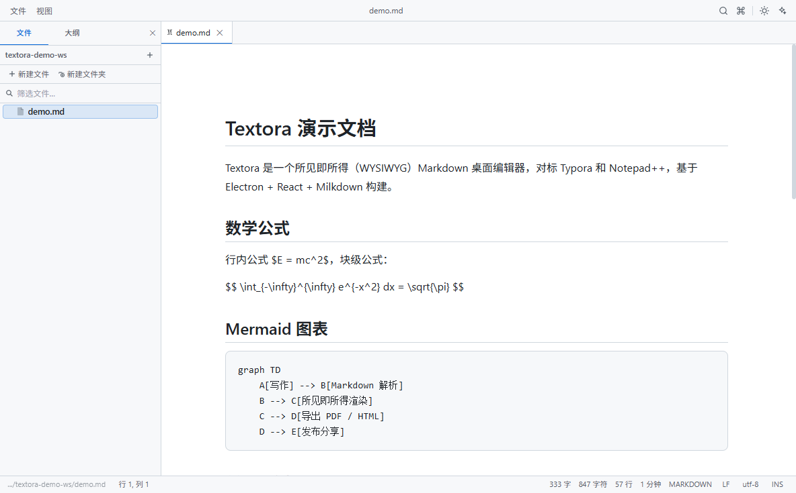
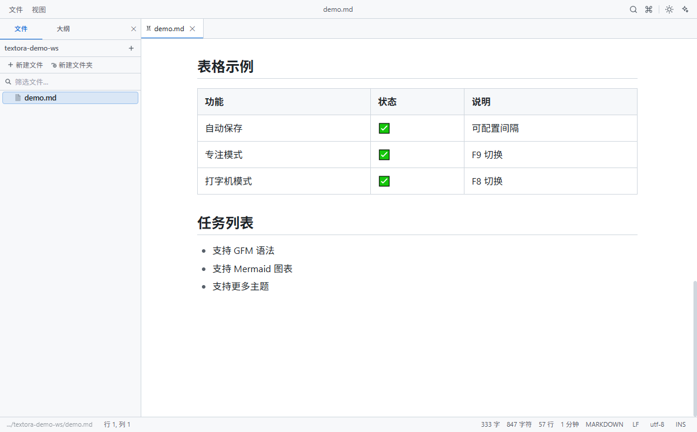
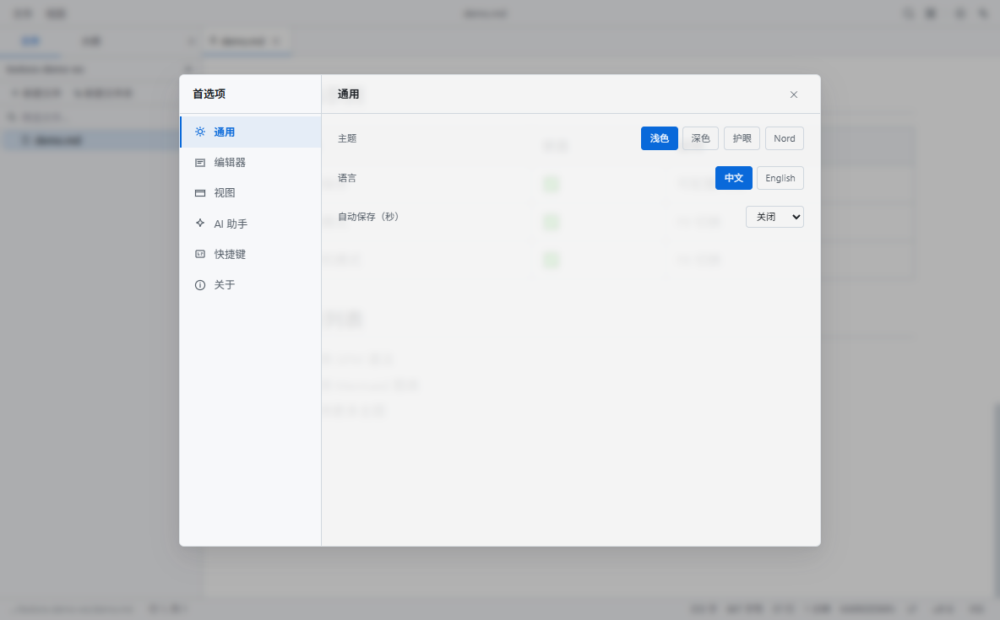
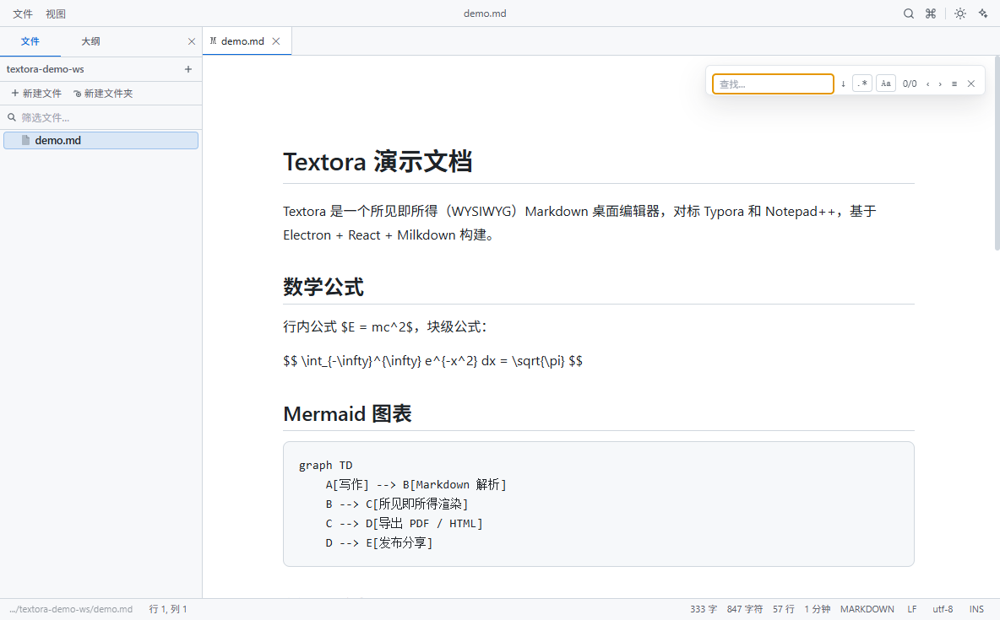

# Textora

> 所见即所得（WYSIWYG）Markdown 桌面编辑器 —— 对标 Typora 和 Notepad++。
>
> 技术栈：**Electron 43 + React 18 + TypeScript + Milkdown 7**（ProseMirror）

Textora 是一款开箱即用的 Markdown 编辑器：既能像 Typora 一样所见即所得地写作，也内置了 Notepad++ 式的代码编辑能力（代码折叠、书签、行操作、符号树），并集成了 AI 写作助手、文件树工作区、PDF/HTML/Word 导出等生产力功能。

---

## 📸 产品预览

### 欢迎页



### 所见即所得编辑（数学公式 + Mermaid 图表）



### 文档渲染（表格 / 任务列表 / 引用 / 代码高亮）



### 设置面板（主题 / 语言 / 自动保存 / 快捷键自定义）



### 查找替换



---

## ✨ 功能特性

### 写作与编辑

- ✅ **所见即所得 Markdown**：标题 / 列表 / 引用 / 任务列表 / 表格 / 脚注 / 分割线，基于 Milkdown (ProseMirror)
- ✅ **代码高亮**：Shiki 语法高亮，37+ 语言，多主题，按需加载
- ✅ **数学公式**：KaTeX 行内 + 块级公式（`$E=mc^2$`、`$$...$$`）
- ✅ **Mermaid 图表**：流程图 / 时序图 / 甘特图等，内容哈希缓存避免输入时重渲
- ✅ **编辑快捷键**（对标 Typora）：`Ctrl/Cmd+1~6` 标题、`Ctrl/Cmd+Shift+Q` 引用、`Ctrl/Cmd+Shift+C` 代码块
- ✅ **Markdown 快捷键补全**：`Ctrl/Cmd+B` 加粗、`Ctrl/Cmd+I` 斜体等（编辑器内原生支持）
- ✅ **图片粘贴/拖拽**：自动保存到 `<workspace>/assets/` 并插入相对路径
- ✅ **图片缩放尺寸持久化**：拖拽缩放后写回 ``（Typora 兼容语法），重新打开/导出保持尺寸
- ✅ **查找替换**：当前文件内查找替换（正则、大小写、替换保留 Markdown 语义），搜索历史
- ✅ **跨文件搜索**：工作区全文搜索，结果键盘导航（↑↓ + Enter），跳转后自动预填当前文件查找

### 文件与工作区

- ✅ **文件树侧边栏**：新建 / 重命名 / 删除 / 过滤，展开状态记忆
- ✅ **外部变更监听**：文件被外部修改时三选提示——**重新加载 / 查看差异 / 忽略**，差异视图对比磁盘版本与当前编辑版本
- ✅ **自动保存**：可配置间隔（0 = 关闭），revision 版本守卫防旧快照覆盖新内容
- ✅ **会话恢复**：启动时恢复上次打开的标签；崩溃/强退时的未保存修改**自动恢复并提示**（可保留或丢弃，不再静默覆盖磁盘）
- ✅ **编码与换行**：UTF-8 / GBK / Latin-1 等编码检测与保存，LF / CRLF 切换
- ✅ **多标签**：拖拽排序、关闭确认、关闭其他/全部

### 代码编辑（Notepad++ 对标）

- ✅ 代码折叠（花括号/缩进）、括号匹配高亮、活动行高亮、缩进参考线
- ✅ 智能自动补全（单词 + 代码片段）、字符边缘线、Ctrl+滚轮缩放
- ✅ 书签系统（Ctrl+F2 标记 / F2 跳转，WYSIWYG 与源码模式均支持）
- ✅ 行操作：排序 / 去重 / 去空行 / 制表符转换
- ✅ 符号树（函数 / 类 / 方法导航）、宏录制回放

### 视图模式

- ✅ 专注模式（F9）、打字机模式（F8）、源码模式（Ctrl+Alt+S）、阅读模式
- ✅ 分屏视图（Ctrl+\）、双栏 Diff 对比、大纲面板、命令面板（Ctrl+Shift+P）、快速打开（Ctrl+P）

### 导出与分享

- ✅ PDF 导出（可选**文件名页眉 / 页码**）
- ✅ HTML 导出 / **复制 HTML 到剪贴板**（图片自动内联 base64）
- ✅ Word 兼容 (.doc) 导出
- ✅ PNG 截图导出

### AI 助手

- ✅ OpenAI 兼容 API（OpenAI / DeepSeek / 通义 / Kimi / 智谱 / Anthropic / Ollama 本地等）
- ✅ 流式输出、多会话管理、工具调用（读文件 / 写文件 / 执行命令 / 抓取网页，均需用户确认）
- ✅ **上下文智能裁剪**：优先当前选区 → 光标前后 2000 字符，长文档下模型也能看到正在编辑的部分

### 其他

- ✅ 4 套主题：Light / Dark / Sepia / Nord；中英文界面（i18n）
- ✅ 快捷键自定义（设置面板可视化绑定 + 冲突检测）
- ✅ 外部工具面板框架（Prettier / ESLint / Git 等，预留 UI 接入点）
- ✅ 崩溃报告 / 日志查看 / 自动更新（可配置发布通道）

---

## 🚀 快速开始

### 环境要求

- Node.js ≥ 22.12（Vite 8 / Electron 43 的最低要求）

### 安装依赖

```bash
npm install
```

> 若 Electron 二进制下载失败（网络问题），设置镜像后重装：
> ```bash
> ELECTRON_MIRROR=https://npmmirror.com/mirrors/electron/ npm install
> ```

### 开发模式

```bash
npm run dev        # concurrently 启动 Electron 主进程 + Vite 渲染进程（HMR）
```

> 遇到 GPU 驱动导致的渲染白屏时：`TEXTORA_DISABLE_GPU=1 npm run dev`

### 生产构建与打包

```bash
npm run build      # tsc 编译主进程 + Vite 构建渲染进程
npm run package    # electron-builder 生成 Windows NSIS 安装包（release/）
```

### 测试

```bash
npm test                 # 单元测试（Vitest，219 个用例）
npm run test:e2e         # E2E 冒烟测试（Playwright，需先 npx playwright install chromium）
npm run test:coverage    # 覆盖率报告
```

---

## ⌨️ 快捷键

| 快捷键 | 功能 |
|---|---|
| Ctrl/Cmd + N | 新建文件 |
| Ctrl/Cmd + O | 打开文件 |
| Ctrl/Cmd + Shift + O | 打开文件夹 |
| Ctrl/Cmd + S / Ctrl/Cmd + Shift + S | 保存 / 另存为 |
| Ctrl/Cmd + J | 切换明暗主题 |
| Ctrl/Cmd + F | 查找替换 |
| Ctrl/Cmd + Shift + F | 跨文件搜索 |
| Ctrl/Cmd + P | 快速打开 |
| Ctrl/Cmd + Shift + P | 命令面板 |
| Ctrl/Cmd + G | 跳转到行 |
| Ctrl/Cmd + B | 切换文件树 |
| Ctrl/Cmd + Alt + S | 切换源码模式 |
| Ctrl/Cmd + Alt + R | 阅读模式 |
| Ctrl/Cmd + 1~6 | 切换标题级别（WYSIWYG） |
| Ctrl/Cmd + Shift + Q | 切换引用块（WYSIWYG） |
| Ctrl/Cmd + Shift + C | 切换代码块（WYSIWYG） |
| Ctrl/Cmd + , | 设置面板 |
| F8 / F9 | 打字机 / 专注模式 |
| Ctrl+F2 / F2 / Shift+F2 | 书签切换 / 下一个 / 上一个 |
| Ctrl+Shift+F2 | 清除所有书签 |
| Ctrl+Space | 触发自动补全 |
| Alt+Shift+S / D / E / T | 排序 / 去重 / 去空行 / 制表符转空格 |
| Ctrl+滚轮 | 缩放编辑器字体 |
| Ctrl+Shift+R / Ctrl+Shift+M | 宏录制 / 回放 |
| Ctrl+\ | 分屏视图 |

> 所有快捷键可在「设置 → 快捷键」中自定义，支持冲突检测。

---

## 🏗️ 技术架构

```
┌─────────────────────────────────────────────────┐
│  Electron 主进程（src/main）                     │
│  ├── 窗口管理 / 生命周期 / 单实例锁              │
│  ├── IPC 处理器（文件/搜索/导出/密钥/对话框）    │
│  ├── 安全层：路径边界校验(TOCTOU/symlink)、      │
│  │   速率限制、SSRF 防护、命令注入防护、CSP      │
│  └── 自动更新 / 崩溃报告 / 日志                  │
├─────────────────────────────────────────────────┤
│  渲染进程（React 18 + Zustand）                  │
│  ├── MilkdownEditor（WYSIWYG + 插件体系）        │
│  │    ├── math (KaTeX) / mermaid / toc / 折叠    │
│  │    ├── Shiki 高亮 / 图片处理 / 快捷键         │
│  │    └── 大文档降级 / 装饰器缓存               │
│  ├── CodeEditor（源码模式 + 虚拟滚动）           │
│  ├── UI 层（文件树/标签/设置/搜索/大纲/命令面板） │
│  └── AI 助手（流式 + 工具调用 + 会话管理）       │
└─────────────────────────────────────────────────┘
```

关键设计：

- **安全**：CSP 严格策略；主进程所有文件操作经 `validateWorkspacePath` 工作区边界校验（含 symlink/junction realpath 复核与 TOCTOU 收窄）；子进程执行 `shell: false` + 危险字符/执行标志拦截 + 超时；URL 抓取 SSRF 防护（内网/元数据地址黑名单 + DNS 反查 + 重定向逐跳校验）
- **性能**：编辑器组件懒加载（Milkdown/shiki/mermaid 独立 chunk）；大文件虚拟滚动；mermaid/数学渲染缓存按内容哈希复用；查找替换分片让出主线程
- **可靠性**：文件写入原子化（临时文件 + rename）+ 重试；自动保存 revision 守卫防旧快照覆盖；窗口关闭确认链 + 主进程 60s 兜底；崩溃恢复会话缓存

---

## 📁 目录结构

```
.
├── docs/screenshots/          # 产品截图（README 用）
├── e2e/                       # Playwright E2E 冒烟测试 + 截图/回归脚本
├── src/
│   ├── App.tsx                # 应用外壳（错误边界 / 全局浮层）
│   ├── ai/                    # AI 服务（流式 / 工具调用 / 供应商配置）
│   ├── editor/
│   │   ├── codeEditor/        # 源码编辑器（组件 + fold/brackets/snippets/utils 子模块）
│   │   ├── contextMenu/       # 右键菜单（actions 命令 / menu 结构）
│   │   └── ...                # MilkdownEditor / 图片 / 查找 / 导出
│   ├── hooks/                 # 快捷键 / 自动保存 / 窗口关闭协议
│   ├── i18n/                  # 中英文（zh.ts / en.ts 字典独立，index.ts 核心）
│   ├── main/                  # Electron 主进程（IPC / 安全层 / 菜单）
│   ├── plugins/               # Milkdown 插件（math / mermaid / shiki / 折叠 / 快捷键）
│   ├── shared/                # 主/渲染共享（常量 / 正则防护）
│   ├── store/
│   │   ├── slices/file/       # 文件切片（editing / saving / tabs / fs 子模块）
│   │   └── ...                # 其他切片
│   ├── test/                  # Vitest 单元测试（27 文件 / 219 用例）
│   └── ui/
│       ├── ai/                # AI 面板（chatLogic 纯函数 / 组件）
│       ├── fileTree/          # 文件树（Entry 节点 / icons / utils）
│       ├── settings/          # 设置面板（按分类拆分 section）
│       ├── topbar/            # 顶栏（items 子组件 / 主组件）
│       └── ...                # 其他组件
├── electron-builder.yml       # 打包配置（NSIS / asarUnpack）
├── playwright.config.mts      # E2E 配置
└── vite.config.mts            # 渲染层构建
```

### 模块化约定

大文件按功能域拆分为聚焦模块，每个模块目录用 `index.ts` 统一出口，外部只依赖目录入口：

| 功能域 | 模块 | 定位入口 |
|---|---|---|
| i18n | `zh.ts` / `en.ts` / `index.ts` | 缺翻译 → 对应字典文件 |
| 右键菜单 | `contextMenu/actions.ts`（命令）+ `menu.ts`（结构） | 菜单项 → menu；命令行为 → actions |
| 源码编辑器 | `codeEditor/`（fold / brackets / snippets / utils） | 折叠 → fold.ts；括号 → brackets.ts |
| 设置面板 | `settings/`（按分类 section + controls） | 按分类直接定位 |
| 文件树 | `fileTree/`（Entry / icons / utils） | 节点交互 → Entry.tsx |
| 文件切片 | `store/slices/file/`（editing / saving / tabs / fs） | 保存 → saving.ts；标签 → tabs.ts |
| 顶栏 | `topbar/`（items / 主组件） | 菜单项组件 → items.tsx |
| AI 面板 | `ai/chatLogic.ts`（上下文提取纯函数） | 上下文逻辑 → chatLogic.ts |

问题定位路径示例：设置面板 AI 分类异常 → `ui/settings/AISection.tsx`；自动保存丢数据 → `store/slices/file/saving.ts`；右键菜单缺项 → `editor/contextMenu/menu.ts`。

---

## 🧪 测试与质量

- **单元测试**：Vitest + jsdom，219 个用例覆盖核心逻辑（保存竞态、会话恢复、窗口关闭协议、速率限制、正则防护、路径安全、导出净化、搜索、宏、AI 工具确认等）
- **E2E**：Playwright 渲染层冒烟测试
- **质量门**：`tsc`（渲染 + 主进程双配置）零错误、ESLint 零告警

---

## 📄 许可证

[LICENSE](LICENSE)
