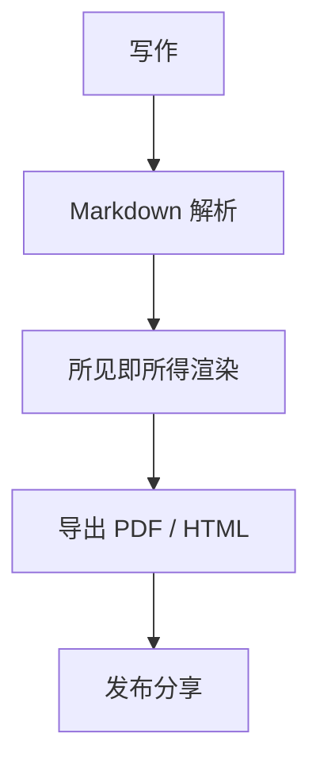

# Textora 演示文档

Textora 是一个所见即所得（WYSIWYG）Markdown 桌面编辑器，对标 Typora 和 Notepad++，基于 Electron + React + Milkdown 构建。

## 数学公式

行内公式 $E = mc^2$，块级公式：

$$
\int_{-\infty}^{\infty} e^{-x^2} dx = \sqrt{\pi}
$$

## Mermaid 图表



## 代码示例

```python
def greet(name: str) -> str:
    """打招呼"""
    return f"Hello, {name}!"

if __name__ == "__main__":
    print(greet("Textora"))
```

## 功能特性

- ✅ 所见即所得编辑：标题 / 列表 / 引用 / 任务列表 / 表格 / 脚注
- ✅ 代码高亮（Shiki，多语言多主题）
- ✅ 数学公式（KaTeX）与 Mermaid 图表
- ✅ 文件树、大纲、查找替换、外部变更监听
- ✅ PDF / HTML / Word 导出，图片粘贴自动存到 `assets/`

> 引用块：专注写作，所见即所得。

## 表格示例

| 功能 | 状态 | 说明 |
| --- | --- | --- |
| 自动保存 | ✅ | 可配置间隔 |
| 专注模式 | ✅ | F9 切换 |
| 打字机模式 | ✅ | F8 切换 |

## 任务列表

- [x] 支持 GFM 语法
- [x] 支持 Mermaid 图表
- [ ] 支持更多主题
